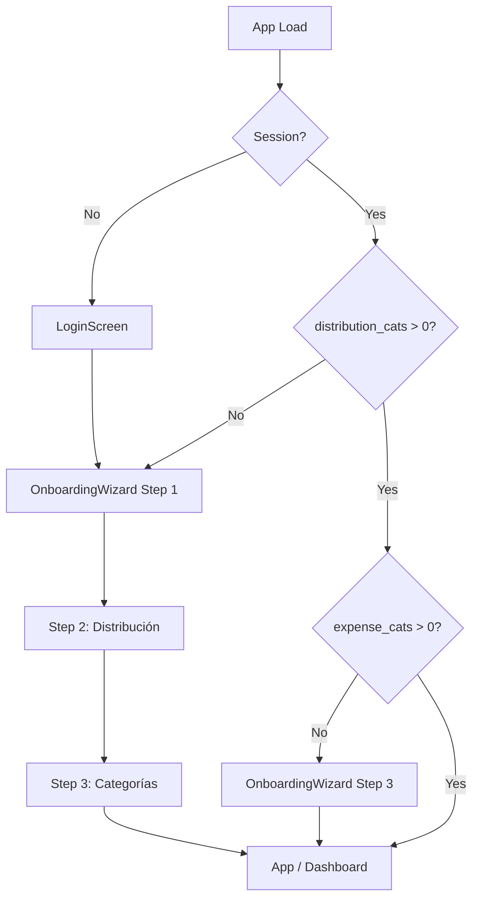

# Plan 003 — Onboarding Wizard & Expense Categories

Esta entrega cierra todos los bugs pendientes de la spec 002 y agrega el wizard de onboarding unificado de 3 pasos y los selectores de categoría/subcategoría de gasto en `MovementForm`.

> [!IMPORTANT]
> La **spec 002 queda supersedida y cerrada**. Todos sus ítems abiertos se absorben aquí.

---

## Decisiones de diseño — ✅ Resueltas

> [!NOTE]
> **Decisión 1 — Entrada al wizard desde Ajustes:** `startStep={3}`. El wizard salta directamente al Step 3 cuando se abre desde Ajustes. Ingresos y distribución se editan desde sus propias secciones.

> [!NOTE]
> **Decisión 2 — Seed de categorías por defecto:** El seed se pre-popula **únicamente en el primer onboarding** (cuando el usuario llega al Step 3 sin ninguna categoría). Si ya tiene categorías, se muestran las existentes sin acción automática.

---

## Diagrama — Nuevo flujo de onboarding



---

## Cambios propuestos

### 1. `[MODIFY]` OnboardingStep1.tsx — Fix design system tokens

**Único cambio:** reemplazar clases hardcodeadas. La lógica queda 100% intacta.

**Archivo completo resultante:**

```tsx
'use client';

import React, { useState } from 'react';
import { LocalProfileRepository } from '../../infrastructure/repositories/local/LocalProfileRepository';
import { LocalIncomeSourceRepository } from '../../infrastructure/repositories/local/LocalIncomeSourceRepository';
import { uuidv7 } from 'uuidv7';

interface Props {
  onComplete: (profileId: string) => void;
}

export default function OnboardingStep1({ onComplete }: Props) {
  const [income, setIncome] = useState<string>('');
  const [isSubmitting, setIsSubmitting] = useState(false);

  const handleSubmit = async (e: React.FormEvent) => {
    e.preventDefault();
    setIsSubmitting(true);

    try {
      const profileRepo = new LocalProfileRepository();
      const incomeRepo = new LocalIncomeSourceRepository();

      const userId = uuidv7();

      // We save the profile
      await profileRepo.save({
        id: userId
      });

      // We save the base income in cents
      const incomeInCents = Math.round(parseFloat(income) * 100);

      await incomeRepo.save({
        id: uuidv7(),
        user_id: userId,
        name: 'Sueldo Base',
        amount: incomeInCents,
      });

      onComplete(userId);
    } catch (err) {
      console.error(err);
    } finally {
      setIsSubmitting(false);
    }
  };

  return (
    <div className="max-w-md mx-auto bg-card border border-border p-6 rounded-2xl shadow-sm">
      <h2 className="text-2xl font-bold text-foreground mb-6">Paso 1: Configuración Básica</h2>
      <form onSubmit={handleSubmit} className="space-y-4">

        <div>
          <label htmlFor="income" className="block text-sm font-medium text-foreground">
            Sueldo o Ingreso Base (Mensual)
          </label>
          <div className="mt-1 relative rounded-md shadow-sm">
            <div className="absolute inset-y-0 left-0 pl-3 flex items-center pointer-events-none">
              <span className="text-muted-foreground sm:text-sm">S/</span>
            </div>
            <input
              type="number"
              name="income"
              id="income"
              required
              step="0.01"
              min="0"
              className="focus:ring-ring focus:border-ring block w-full pl-10 sm:text-sm border-input rounded-xl py-2.5 border bg-background text-foreground focus:outline-none focus:ring-2 transition-colors"
              placeholder="0.00"
              value={income}
              onChange={(e) => setIncome(e.target.value)}
            />
          </div>
        </div>

        <button
          type="submit"
          disabled={isSubmitting}
          className="w-full flex justify-center py-2.5 px-4 border border-transparent rounded-xl shadow-sm text-sm font-semibold text-primary-foreground bg-primary hover:bg-primary/90 focus:outline-none focus:ring-2 focus:ring-offset-2 focus:ring-ring transition-colors disabled:opacity-50"
        >
          {isSubmitting ? 'Guardando...' : 'Continuar'}
        </button>
      </form>
    </div>
  );
}
```

---

### 2. `[MODIFY]` MovementList.tsx — Fix hardcoded colors

**Archivo completo resultante:**

```tsx
'use client';

import React, { useCallback, useEffect, useState } from 'react';
import { LocalMovementRepository } from '../../infrastructure/repositories/local/LocalMovementRepository';
import { Movement } from '../../core/domain/models/types';
import { calculateMonthlyCycle } from '../../core/use-cases/calculateMonthlyCycle';

interface Props {
  userId: string;
}

export default function MovementList({ userId }: Props) {
  const [movements, setMovements] = useState<Movement[]>([]);
  const [loading, setLoading] = useState(true);

  const loadMovements = useCallback(async () => {
    try {
      const repo = new LocalMovementRepository();
      const [start, end] = calculateMonthlyCycle(new Date());
      const data = await repo.getAllByCycle(userId, start, end);
      // Sort newest first
      data.sort((a, b) => b.date.getTime() - a.date.getTime());
      setMovements(data);
    } catch (err) {
      console.error(err);
    } finally {
      setLoading(false);
    }
  }, [userId]);

  useEffect(() => {
    loadMovements();
  }, [loadMovements]);

  const handleDelete = async (id: string) => {
    if (!window.confirm('¿Seguro que deseas eliminar este movimiento?')) return;
    try {
      const repo = new LocalMovementRepository();
      await repo.delete(id);
      await loadMovements();
    } catch (err) {
      console.error(err);
    }
  };

  if (loading) return <div className="text-center py-4 text-muted-foreground">Cargando...</div>;

  if (movements.length === 0) {
    return (
      <div className="text-center py-8 bg-card rounded-xl shadow-sm border border-border">
        <p className="text-muted-foreground">No hay movimientos en este mes.</p>
      </div>
    );
  }

  return (
    <div className="bg-card rounded-xl shadow-sm border border-border overflow-hidden">
      <ul className="divide-y divide-border">
        {movements.map(m => (
          <li key={m.id} className="p-4 hover:bg-muted flex justify-between items-center">
            <div>
              <p className="text-sm font-medium text-foreground">{m.description || 'Sin descripción'}</p>
              <p className="text-xs text-muted-foreground">
                {new Date(m.date).toLocaleDateString()}
              </p>
            </div>
            <div className="flex items-center space-x-4">
              <span className={`text-sm font-bold ${m.type === 'INCOME' ? 'text-emerald-600 dark:text-emerald-400' : 'text-foreground'}`}>
                {m.type === 'INCOME' ? '+' : '-'} S/ {(m.amount / 100).toFixed(2)}
              </span>
              <button
                onClick={() => handleDelete(m.id)}
                className="text-destructive hover:text-destructive/80 text-xs font-medium"
              >
                Eliminar
              </button>
            </div>
          </li>
        ))}
      </ul>
    </div>
  );
}
```

---

### 3. `[MODIFY]` MovementForm.tsx — Fix UUID bug + add expense category selectors

**Cambios respecto al archivo actual:**
1. Orden de `setState` en `loadData` para eliminar UUID flash (líneas 43-46 actuales).
2. Carga de `expenseCategories` dentro del mismo `loadData`.
3. Nuevo `useEffect` para `subcategories` dependiente de `expenseCategoryId`.
4. Dos nuevos `<Select>` bajo el selector de distribución, visibles solo cuando `type === 'EXPENSE'`.
5. `handleSubmit` pasa `expense_category_id` y `expense_subcategory_id`.

**Archivo completo resultante:**

```tsx
'use client';

import React, { useState, useEffect } from 'react';
import { LocalMovementRepository } from '../../infrastructure/repositories/local/LocalMovementRepository';
import { LocalCategoryRepository } from '../../infrastructure/repositories/local/LocalCategoryRepository';
import { LocalSavingsGoalRepository } from '../../infrastructure/repositories/local/LocalSavingsGoalRepository';
import { DistributionCategory, ExpenseCategory, ExpenseSubcategory, SavingsGoal } from '../../core/domain/models/types';
import { Card, CardHeader, CardTitle, CardContent } from '@/components/ui/card';
import { Button } from '@/components/ui/button';
import { Input } from '@/components/ui/input';
import { Label } from '@/components/ui/label';
import { Loader2 } from 'lucide-react';
import { Select, SelectContent, SelectItem, SelectTrigger, SelectValue } from '@/components/ui/select';

interface Props {
  userId: string;
  onComplete: () => void;
  onCancel: () => void;
}

export default function MovementForm({ userId, onComplete, onCancel }: Props) {
  const [type, setType] = useState<'EXPENSE' | 'INCOME'>('EXPENSE');
  const [amount, setAmount] = useState<string>('');
  const [description, setDescription] = useState<string>('');

  // Distribution category
  const [distCategoryId, setDistCategoryId] = useState<string>('');
  const [distCategories, setDistCategories] = useState<DistributionCategory[]>([]);

  // Expense category + subcategory
  const [expenseCategoryId, setExpenseCategoryId] = useState<string>('');
  const [expenseCategories, setExpenseCategories] = useState<ExpenseCategory[]>([]);
  const [expenseSubcategoryId, setExpenseSubcategoryId] = useState<string>('');
  const [subcategories, setSubcategories] = useState<ExpenseSubcategory[]>([]);

  // Savings goal
  const [savingsGoalId, setSavingsGoalId] = useState<string>('');
  const [savingsGoals, setSavingsGoals] = useState<SavingsGoal[]>([]);

  const [isRecurring, setIsRecurring] = useState(false);
  const [isSubmitting, setIsSubmitting] = useState(false);
  const [dataLoaded, setDataLoaded] = useState(false);

  // Load all static data on mount.
  // IMPORTANT: distCategoryId must be set BEFORE dataLoaded=true so the Select
  // never renders with an empty value (which would show the raw UUID).
  useEffect(() => {
    const loadData = async () => {
      const catRepo = new LocalCategoryRepository();
      const goalRepo = new LocalSavingsGoalRepository();

      const [cats, expCats, goals] = await Promise.all([
        catRepo.getDistributionCategories(userId),
        catRepo.getExpenseCategories(userId),
        goalRepo.getAll(userId),
      ]);

      setDistCategories(cats);
      setExpenseCategories(expCats);
      setSavingsGoals(goals);
      // Set selected values BEFORE enabling Select render
      if (cats.length > 0) setDistCategoryId(cats[0].id);
      if (expCats.length > 0) setExpenseCategoryId(expCats[0].id);
      setDataLoaded(true);
    };
    loadData();
  }, [userId]);

  // Load subcategories whenever the selected expense category changes.
  useEffect(() => {
    if (!expenseCategoryId) {
      setSubcategories([]);
      return;
    }
    const catRepo = new LocalCategoryRepository();
    catRepo.getSubcategories(expenseCategoryId).then(setSubcategories);
  }, [expenseCategoryId]);

  const handleExpenseCategoryChange = (id: string) => {
    setExpenseCategoryId(id);
    setExpenseSubcategoryId(''); // cascade reset
  };

  const handleSubmit = async (e: React.FormEvent) => {
    e.preventDefault();
    setIsSubmitting(true);

    try {
      const repo = new LocalMovementRepository();
      const amountInCents = Math.round(parseFloat(amount.replace(/,/g, '')) * 100);

      await repo.save({
        id: '',
        user_id: userId,
        type,
        amount: amountInCents,
        date: new Date(),
        description,
        distribution_category_id: type === 'EXPENSE' ? distCategoryId : undefined,
        expense_category_id: type === 'EXPENSE' && expenseCategoryId ? expenseCategoryId : undefined,
        expense_subcategory_id: type === 'EXPENSE' && expenseSubcategoryId ? expenseSubcategoryId : undefined,
        savings_goal_id: type === 'EXPENSE' && savingsGoalId ? savingsGoalId : undefined,
        is_recurring: isRecurring,
      });

      onComplete();
    } catch (err) {
      console.error(err);
    } finally {
      setIsSubmitting(false);
    }
  };

  const selectedCategory = distCategories.find(c => c.id === distCategoryId);
  const showSavingsGoal =
    type === 'EXPENSE' &&
    savingsGoals.length > 0 &&
    selectedCategory?.name.toLowerCase().includes('ahorro');

  return (
    <Card className="w-full">
      <CardHeader>
        <CardTitle>Registrar Movimiento</CardTitle>
      </CardHeader>
      <CardContent>
        <form onSubmit={handleSubmit} data-testid="movement-form" className="space-y-4">
          {/* Type toggle — visual tab style */}
          <div className="space-y-2">
            <Label>Tipo</Label>
            <div className="grid grid-cols-2 gap-2 bg-muted p-1 rounded-xl">
              <button
                type="button"
                onClick={() => setType('EXPENSE')}
                className={`py-2 px-3 rounded-lg text-sm font-medium transition-colors ${
                  type === 'EXPENSE'
                    ? 'bg-card text-foreground shadow-sm'
                    : 'text-muted-foreground hover:text-foreground'
                }`}
              >
                💸 Gasto
              </button>
              <button
                type="button"
                onClick={() => setType('INCOME')}
                className={`py-2 px-3 rounded-lg text-sm font-medium transition-colors ${
                  type === 'INCOME'
                    ? 'bg-card text-foreground shadow-sm'
                    : 'text-muted-foreground hover:text-foreground'
                }`}
              >
                💰 Ingreso
              </button>
            </div>
          </div>

          {/* Distribution category — only render Select once data is loaded to avoid UUID flash */}
          {type === 'EXPENSE' && (
            <div className="space-y-2">
              <Label htmlFor="distCat">Categoría (50/30/20)</Label>
              {dataLoaded ? (
                <Select value={distCategoryId} onValueChange={(val) => setDistCategoryId(val || '')} required>
                  <SelectTrigger id="distCat">
                    <SelectValue placeholder="Seleccionar categoría" />
                  </SelectTrigger>
                  <SelectContent>
                    {distCategories.map(c => (
                      <SelectItem key={c.id} value={c.id}>{c.name}</SelectItem>
                    ))}
                  </SelectContent>
                </Select>
              ) : (
                <div className="h-10 bg-muted rounded-xl animate-pulse" />
              )}
            </div>
          )}

          {/* Expense category — cascaded, only for EXPENSE type */}
          {type === 'EXPENSE' && (
            <div className="space-y-2">
              <Label htmlFor="expenseCat">Categoría de gasto</Label>
              {dataLoaded ? (
                <Select
                  value={expenseCategoryId}
                  onValueChange={handleExpenseCategoryChange}
                >
                  <SelectTrigger id="expenseCat">
                    <SelectValue placeholder="Seleccionar categoría de gasto" />
                  </SelectTrigger>
                  <SelectContent>
                    {expenseCategories.map(c => (
                      <SelectItem key={c.id} value={c.id}>{c.name}</SelectItem>
                    ))}
                  </SelectContent>
                </Select>
              ) : (
                <div className="h-10 bg-muted rounded-xl animate-pulse" />
              )}
            </div>
          )}

          {/* Expense subcategory — enabled only when a category is selected */}
          {type === 'EXPENSE' && expenseCategoryId && (
            <div className="space-y-2">
              <Label htmlFor="expenseSubcat">Subcategoría</Label>
              {dataLoaded ? (
                <Select
                  value={expenseSubcategoryId}
                  onValueChange={(val) => setExpenseSubcategoryId(val || '')}
                >
                  <SelectTrigger id="expenseSubcat">
                    <SelectValue placeholder="Seleccionar subcategoría" />
                  </SelectTrigger>
                  <SelectContent>
                    {subcategories.map(s => (
                      <SelectItem key={s.id} value={s.id}>{s.name}</SelectItem>
                    ))}
                  </SelectContent>
                </Select>
              ) : (
                <div className="h-10 bg-muted rounded-xl animate-pulse" />
              )}
            </div>
          )}

          {/* Savings goal */}
          {showSavingsGoal && dataLoaded && (
            <div className="space-y-2">
              <Label htmlFor="savingsGoal">Meta de Ahorro (Opcional)</Label>
              <Select value={savingsGoalId} onValueChange={(val) => setSavingsGoalId(val || '')}>
                <SelectTrigger id="savingsGoal">
                  <SelectValue placeholder="— Sin asignar —" />
                </SelectTrigger>
                <SelectContent>
                  <SelectItem value="unassigned">— Sin asignar —</SelectItem>
                  {savingsGoals.map(g => (
                    <SelectItem key={g.id} value={g.id}>{g.name}</SelectItem>
                  ))}
                </SelectContent>
              </Select>
            </div>
          )}

          {/* Amount */}
          <div className="space-y-2">
            <Label htmlFor="amount">Monto</Label>
            <div className="relative">
              <div className="absolute inset-y-0 left-0 pl-3 flex items-center pointer-events-none">
                <span className="text-muted-foreground text-sm font-medium">S/</span>
              </div>
              <Input
                type="text"
                id="amount"
                required
                className="pl-9"
                placeholder="0.00"
                value={amount}
                onFocus={() => {
                  if (amount) setAmount(amount.replace(/,/g, ''));
                }}
                onBlur={() => {
                  if (amount && !isNaN(Number(amount))) {
                    setAmount(
                      Number(amount).toLocaleString('en-US', {
                        minimumFractionDigits: 2,
                        maximumFractionDigits: 2,
                      })
                    );
                  }
                }}
                onChange={(e) => {
                  const val = e.target.value.replace(/[^0-9.]/g, '');
                  setAmount(val);
                }}
              />
            </div>
          </div>

          {/* Description */}
          <div className="space-y-2">
            <Label htmlFor="description">Descripción</Label>
            <Input
              type="text"
              id="description"
              placeholder="Ej. Cena familiar"
              value={description}
              onChange={(e) => setDescription(e.target.value)}
            />
          </div>

          {/* Recurring */}
          <div className="flex items-center space-x-2">
            <input
              id="isRecurring"
              type="checkbox"
              className="h-4 w-4 rounded border-input accent-primary"
              checked={isRecurring}
              onChange={(e) => setIsRecurring(e.target.checked)}
            />
            <Label htmlFor="isRecurring" className="cursor-pointer">
              Es un gasto fijo (recurrente cada mes)
            </Label>
          </div>

          {/* Actions */}
          <div className="flex gap-3 pt-2">
            <Button
              type="button"
              variant="outline"
              onClick={onCancel}
              disabled={isSubmitting}
              className="flex-1"
            >
              Cancelar
            </Button>
            <Button
              type="submit"
              disabled={isSubmitting}
              className="flex-1"
            >
              {isSubmitting && <Loader2 className="mr-2 h-4 w-4 animate-spin" />}
              Guardar
            </Button>
          </div>
        </form>
      </CardContent>
    </Card>
  );
}
```

---

### 4. `[NEW]` OnboardingWizard.tsx — Wizard unificado de 3 pasos

**Archivo completo:**

```tsx
'use client';

import React, { useState, useEffect, useCallback } from 'react';
import { LocalCategoryRepository } from '../../infrastructure/repositories/local/LocalCategoryRepository';
import { LocalMovementRepository } from '../../infrastructure/repositories/local/LocalMovementRepository';
import { ExpenseCategory, ExpenseSubcategory } from '../../core/domain/models/types';
import { uuidv7 } from 'uuidv7';
import OnboardingStep1 from './OnboardingStep1';
import OnboardingStep2 from './OnboardingStep2';

// ---------------------------------------------------------------------------
// Seed data for Step 3 (populated only when no expense categories exist)
// ---------------------------------------------------------------------------
const DEFAULT_CATEGORIES = [
  { name: 'Alimentación', subcategories: ['Desayuno', 'Almuerzo', 'Cena', 'Snack'] },
  { name: 'Ocio',         subcategories: ['Deporte', 'Cine', 'Fiesta', 'Restaurante'] },
  { name: 'Transporte',   subcategories: ['Combustible', 'Taxi/Uber', 'Transporte público'] },
];

// ---------------------------------------------------------------------------
// Types
// ---------------------------------------------------------------------------
interface Props {
  profileId: string;
  startStep?: 1 | 2 | 3;
  onComplete: () => void;
}

interface CategoryWithSubs {
  category: ExpenseCategory;
  subcategories: ExpenseSubcategory[];
}

// ---------------------------------------------------------------------------
// Progress indicator
// ---------------------------------------------------------------------------
function ProgressBar({ currentStep }: { currentStep: 1 | 2 | 3 }) {
  const steps = [
    { number: 1, label: 'Ingresos' },
    { number: 2, label: 'Distribución' },
    { number: 3, label: 'Categorías' },
  ];

  return (
    <div className="flex items-center justify-center gap-0 mb-8 px-4">
      {steps.map((step, idx) => {
        const isCompleted = step.number < currentStep;
        const isActive = step.number === currentStep;
        return (
          <React.Fragment key={step.number}>
            <div className="flex flex-col items-center gap-1">
              <div
                className={`w-8 h-8 rounded-full flex items-center justify-center text-sm font-bold transition-colors ${
                  isCompleted
                    ? 'bg-primary text-primary-foreground'
                    : isActive
                    ? 'bg-primary text-primary-foreground ring-4 ring-primary/20'
                    : 'bg-muted text-muted-foreground'
                }`}
              >
                {isCompleted ? '✓' : step.number}
              </div>
              <span className={`text-xs font-medium ${isActive ? 'text-foreground' : 'text-muted-foreground'}`}>
                {step.label}
              </span>
            </div>
            {idx < steps.length - 1 && (
              <div
                className={`h-0.5 w-12 mb-5 mx-1 transition-colors ${
                  step.number < currentStep ? 'bg-primary' : 'bg-border'
                }`}
              />
            )}
          </React.Fragment>
        );
      })}
    </div>
  );
}

// ---------------------------------------------------------------------------
// Step 3 — Expense category management
// ---------------------------------------------------------------------------
function Step3Categories({
  profileId,
  onComplete,
}: {
  profileId: string;
  onComplete: () => void;
}) {
  const [items, setItems] = useState<CategoryWithSubs[]>([]);
  const [loading, setLoading] = useState(true);
  const [seeded, setSeeded] = useState(false);

  // New category input
  const [newCatName, setNewCatName] = useState('');
  const [addingCat, setAddingCat] = useState(false);

  // New subcategory input — keyed by categoryId
  const [newSubName, setNewSubName] = useState<Record<string, string>>({});
  const [addingSubFor, setAddingSubFor] = useState<string | null>(null);

  // Inline error messages
  const [errors, setErrors] = useState<Record<string, string>>({});

  const catRepo = new LocalCategoryRepository();
  const movRepo = new LocalMovementRepository();

  // Load all categories + their subcategories
  const loadAll = useCallback(async () => {
    const cats = await catRepo.getExpenseCategories(profileId);
    const withSubs: CategoryWithSubs[] = await Promise.all(
      cats.map(async (cat) => ({
        category: cat,
        subcategories: await catRepo.getSubcategories(cat.id),
      }))
    );
    setItems(withSubs);
    setLoading(false);
    return cats;
  }, [profileId]); // eslint-disable-line react-hooks/exhaustive-deps

  // Seed on first load if no categories exist
  useEffect(() => {
    const init = async () => {
      const cats = await loadAll();
      if (cats.length === 0 && !seeded) {
        setSeeded(true);
        for (const def of DEFAULT_CATEGORIES) {
          const catId = uuidv7();
          await catRepo.saveExpenseCategory({ id: catId, user_id: profileId, name: def.name });
          for (const subName of def.subcategories) {
            await catRepo.saveSubcategory({ id: uuidv7(), category_id: catId, name: subName });
          }
        }
        await loadAll();
      }
    };
    init();
  }, []); // eslint-disable-line react-hooks/exhaustive-deps

  const handleAddCategory = async () => {
    const name = newCatName.trim();
    if (!name) return;
    const catId = uuidv7();
    await catRepo.saveExpenseCategory({ id: catId, user_id: profileId, name });
    setNewCatName('');
    setAddingCat(false);
    await loadAll();
  };

  const handleDeleteCategory = async (categoryId: string) => {
    const count = await movRepo.countByExpenseCategory(categoryId);
    if (count > 0) {
      setErrors(prev => ({
        ...prev,
        [categoryId]: `No se puede eliminar: tiene ${count} movimiento${count > 1 ? 's' : ''} asociado${count > 1 ? 's' : ''}.`,
      }));
      return;
    }
    setErrors(prev => { const next = { ...prev }; delete next[categoryId]; return next; });
    await catRepo.deleteExpenseCategory(categoryId);
    await loadAll();
  };

  const handleAddSubcategory = async (categoryId: string) => {
    const name = (newSubName[categoryId] || '').trim();
    if (!name) return;
    await catRepo.saveSubcategory({ id: uuidv7(), category_id: categoryId, name });
    setNewSubName(prev => ({ ...prev, [categoryId]: '' }));
    setAddingSubFor(null);
    await loadAll();
  };

  const handleDeleteSubcategory = async (subcategoryId: string, categoryId: string) => {
    const count = await movRepo.countByExpenseSubcategory(subcategoryId);
    if (count > 0) {
      setErrors(prev => ({
        ...prev,
        [subcategoryId]: `No se puede eliminar: tiene ${count} movimiento${count > 1 ? 's' : ''} asociado${count > 1 ? 's' : ''}.`,
      }));
      return;
    }
    setErrors(prev => { const next = { ...prev }; delete next[subcategoryId]; return next; });
    await catRepo.deleteSubcategory(subcategoryId);
    // Reload just this category's subs
    const updatedSubs = await catRepo.getSubcategories(categoryId);
    setItems(prev => prev.map(item =>
      item.category.id === categoryId
        ? { ...item, subcategories: updatedSubs }
        : item
    ));
  };

  // "Finalizar" is enabled when at least 1 category with at least 1 subcategory exists
  const canFinish = items.some(item => item.subcategories.length > 0);

  if (loading) {
    return <div className="text-center py-8 text-muted-foreground">Cargando...</div>;
  }

  return (
    <div className="max-w-md mx-auto px-4 space-y-4">
      <div className="bg-card border border-border rounded-2xl shadow-sm p-6 space-y-4">
        <div>
          <h2 className="text-2xl font-bold text-foreground">Categorías de gasto</h2>
          <p className="text-sm text-muted-foreground mt-1">
            Organizá tus gastos en categorías y subcategorías.
          </p>
        </div>

        {/* Category list */}
        <div className="space-y-3">
          {items.map(({ category, subcategories }) => (
            <div key={category.id} className="border border-border rounded-xl p-4 space-y-2">
              {/* Category header */}
              <div className="flex items-center justify-between">
                <span className="text-sm font-semibold text-foreground">{category.name}</span>
                <button
                  onClick={() => handleDeleteCategory(category.id)}
                  className="text-destructive hover:text-destructive/80 text-xs font-medium"
                  aria-label={`Eliminar categoría ${category.name}`}
                >
                  Eliminar
                </button>
              </div>

              {/* Category-level error */}
              {errors[category.id] && (
                <p className="text-xs text-destructive">{errors[category.id]}</p>
              )}

              {/* Subcategory list */}
              <ul className="pl-3 space-y-1">
                {subcategories.map(sub => (
                  <li key={sub.id} className="flex items-center justify-between text-sm">
                    <span className="text-muted-foreground">• {sub.name}</span>
                    <button
                      onClick={() => handleDeleteSubcategory(sub.id, category.id)}
                      className="text-destructive/70 hover:text-destructive text-xs ml-2"
                      aria-label={`Eliminar subcategoría ${sub.name}`}
                    >
                      ×
                    </button>
                  </li>
                ))}
                {errors[subcategories.find(s => errors[s.id])?.id ?? ''] && (
                  <li className="text-xs text-destructive">
                    {errors[subcategories.find(s => errors[s.id])?.id ?? '']}
                  </li>
                )}
              </ul>

              {/* Add subcategory inline */}
              {addingSubFor === category.id ? (
                <div className="flex gap-2 mt-1">
                  <input
                    autoFocus
                    type="text"
                    placeholder="Nombre de subcategoría"
                    value={newSubName[category.id] || ''}
                    onChange={(e) =>
                      setNewSubName(prev => ({ ...prev, [category.id]: e.target.value }))
                    }
                    onKeyDown={(e) => {
                      if (e.key === 'Enter') { e.preventDefault(); handleAddSubcategory(category.id); }
                      if (e.key === 'Escape') setAddingSubFor(null);
                    }}
                    className="flex-1 bg-background border border-input rounded-lg py-1.5 px-3 text-sm text-foreground focus:outline-none focus:ring-2 focus:ring-ring transition-colors"
                  />
                  <button
                    onClick={() => handleAddSubcategory(category.id)}
                    className="py-1.5 px-3 bg-primary text-primary-foreground rounded-lg text-sm font-medium hover:bg-primary/90 transition-colors"
                  >
                    Agregar
                  </button>
                  <button
                    onClick={() => setAddingSubFor(null)}
                    className="py-1.5 px-3 bg-muted text-muted-foreground rounded-lg text-sm hover:bg-muted/80 transition-colors"
                  >
                    ×
                  </button>
                </div>
              ) : (
                <button
                  onClick={() => setAddingSubFor(category.id)}
                  className="text-xs text-primary hover:text-primary/80 font-medium mt-1"
                >
                  + Agregar subcategoría
                </button>
              )}
            </div>
          ))}
        </div>

        {/* Add category */}
        {addingCat ? (
          <div className="flex gap-2">
            <input
              autoFocus
              type="text"
              placeholder="Nombre de categoría"
              value={newCatName}
              onChange={(e) => setNewCatName(e.target.value)}
              onKeyDown={(e) => {
                if (e.key === 'Enter') { e.preventDefault(); handleAddCategory(); }
                if (e.key === 'Escape') setAddingCat(false);
              }}
              className="flex-1 bg-background border border-input rounded-xl py-2 px-3 text-sm text-foreground focus:outline-none focus:ring-2 focus:ring-ring transition-colors"
            />
            <button
              onClick={handleAddCategory}
              className="py-2 px-4 bg-primary text-primary-foreground rounded-xl text-sm font-medium hover:bg-primary/90 transition-colors"
            >
              Agregar
            </button>
            <button
              onClick={() => setAddingCat(false)}
              className="py-2 px-3 bg-muted text-muted-foreground rounded-xl text-sm hover:bg-muted/80 transition-colors"
            >
              ×
            </button>
          </div>
        ) : (
          <button
            onClick={() => setAddingCat(true)}
            className="w-full py-2.5 px-4 border border-dashed border-border rounded-xl text-sm font-medium text-muted-foreground hover:text-foreground hover:border-foreground/30 transition-colors"
          >
            + Nueva categoría
          </button>
        )}

        {/* Finish button */}
        <button
          onClick={onComplete}
          disabled={!canFinish}
          className="w-full py-3 px-4 rounded-xl text-sm font-semibold text-primary-foreground bg-primary hover:bg-primary/90 transition-colors disabled:opacity-40 focus-visible:outline-none focus-visible:ring-2 focus-visible:ring-ring"
        >
          Finalizar configuración
        </button>

        {!canFinish && (
          <p className="text-xs text-muted-foreground text-center">
            Necesitás al menos una categoría con una subcategoría para continuar.
          </p>
        )}
      </div>
    </div>
  );
}

// ---------------------------------------------------------------------------
// Main wizard component
// ---------------------------------------------------------------------------
export default function OnboardingWizard({ profileId, startStep = 1, onComplete }: Props) {
  const [currentStep, setCurrentStep] = useState<1 | 2 | 3>(startStep);
  const [wizardProfileId, setWizardProfileId] = useState<string>(profileId);

  const handleStep1Complete = (newProfileId: string) => {
    setWizardProfileId(newProfileId);
    setCurrentStep(2);
  };

  const handleStep2Complete = () => {
    setCurrentStep(3);
  };

  const handleStep3Complete = () => {
    onComplete();
  };

  return (
    <div className="min-h-screen bg-background flex flex-col justify-center py-12 sm:px-6 lg:px-8">
      <div className="sm:mx-auto sm:w-full sm:max-w-md mb-2">
        <div className="flex items-center justify-center gap-2 mb-6">
          <span className="text-3xl">🌿</span>
          <h1 className="text-2xl font-extrabold text-foreground tracking-tight">ez-life</h1>
        </div>
        <ProgressBar currentStep={currentStep} />
      </div>

      {currentStep === 1 && (
        <OnboardingStep1 onComplete={handleStep1Complete} />
      )}

      {currentStep === 2 && (
        <OnboardingStep2 profileId={wizardProfileId} onComplete={handleStep2Complete} />
      )}

      {currentStep === 3 && (
        <Step3Categories profileId={wizardProfileId} onComplete={handleStep3Complete} />
      )}
    </div>
  );
}
```

---

### 5. `[MODIFY]` MainFlow.tsx — Nuevo gate + reemplazar onboarding-1/2

**Diff exacto respecto al archivo actual:**

```diff
 import React, { useState } from 'react';
 import LoginScreen from './LoginScreen';
-import OnboardingStep1 from './OnboardingStep1';
-import OnboardingStep2 from './OnboardingStep2';
+import OnboardingWizard from './OnboardingWizard';
 import Layout from './Layout';
 ...

-export default function MainFlow() {
-  const [step, setStep] = useState<'loading' | 'login' | 'onboarding-1' | 'onboarding-2' | 'app'>('loading');
+export default function MainFlow() {
+  const [step, setStep] = useState<'loading' | 'login' | 'onboarding-wizard' | 'app'>('loading');
+  const [wizardStartStep, setWizardStartStep] = useState<1 | 2 | 3>(1);
   const [currentRoute, setCurrentRoute] = useState('dashboard');
   const [profileId, setProfileId] = useState<string | null>(null);
   ...

         try {
           const catRepo = new LocalCategoryRepository();
           const cats = await catRepo.getDistributionCategories(userId);
+          const expCats = await catRepo.getExpenseCategories(userId);
           if (cats.length === 0) {
-            setStep('onboarding-2');
+            setWizardStartStep(1);
+            setStep('onboarding-wizard');
+          } else if (expCats.length === 0) {
+            setWizardStartStep(3);
+            setStep('onboarding-wizard');
           } else {
             setStep('app');
           }
         ...

-  if (step === 'login') {
-    return <LoginScreen onSkip={() => setStep('onboarding-1')} />;
-  }
-
-  if (step === 'onboarding-1') {
-    return (
-      <div className="min-h-screen bg-background flex flex-col justify-center py-12 sm:px-6 lg:px-8">
-        <OnboardingStep1 onComplete={(id) => { setProfileId(id); setStep('onboarding-2'); }} />
-      </div>
-    );
-  }
-
-  if (step === 'onboarding-2' && profileId) {
-    return (
-      <div className="min-h-screen bg-background flex flex-col justify-center py-12 sm:px-6 lg:px-8">
-        <OnboardingStep2 profileId={profileId} onComplete={() => setStep('app')} />
-      </div>
-    );
-  }
+  if (step === 'login') {
+    return (
+      <LoginScreen
+        onSkip={() => {
+          setWizardStartStep(1);
+          setStep('onboarding-wizard');
+        }}
+      />
+    );
+  }
+
+  if (step === 'onboarding-wizard') {
+    return (
+      <OnboardingWizard
+        profileId={profileId ?? ''}
+        startStep={wizardStartStep}
+        onComplete={() => setStep('app')}
+      />
+    );
+  }

 ...

         {currentRoute === 'settings' && profileId && (
           <SettingsScreen
             userId={profileId}
-            onEditCategories={() => setStep('onboarding-2')}
+            onEditCategories={() => { setWizardStartStep(3); setStep('onboarding-wizard'); }}
             onLogout={() => setStep('login')}
           />
         )}
```

**Archivo completo resultante de MainFlow.tsx:**

```tsx
'use client';

import React, { useState } from 'react';
import LoginScreen from './LoginScreen';
import OnboardingWizard from './OnboardingWizard';
import Layout from './Layout';
import Dashboard from './Dashboard';
import MovementList from './MovementList';
import MovementForm from './MovementForm';
import SavingsGoalList from './SavingsGoalList';
import SettingsScreen from './SettingsScreen';
import { useRecurrenceEvaluator } from '../hooks/useRecurrenceEvaluator';
import { useSyncManager } from '../hooks/useSyncManager';
import { LocalCategoryRepository } from '../../infrastructure/repositories/local/LocalCategoryRepository';

export default function MainFlow() {
  const [step, setStep] = useState<'loading' | 'login' | 'onboarding-wizard' | 'app'>('loading');
  const [wizardStartStep, setWizardStartStep] = useState<1 | 2 | 3>(1);
  const [currentRoute, setCurrentRoute] = useState('dashboard');
  const [profileId, setProfileId] = useState<string | null>(null);
  const [showMovementForm, setShowMovementForm] = useState(false);
  const [avatarUrl, setAvatarUrl] = useState<string | undefined>(undefined);

  // Background Jobs
  useRecurrenceEvaluator(profileId);
  useSyncManager();

  React.useEffect(() => {
    import('../../infrastructure/supabase/client').then(({ getSupabaseBrowserClient }) => {
      const supabase = getSupabaseBrowserClient();

      // eslint-disable-next-line @typescript-eslint/no-explicit-any
      const checkSessionAndCategories = async (session: any) => {
        if (session?.user) {
          const userId = session.user.id;
          setProfileId(userId);
          // Read avatar from OAuth metadata (Google / GitHub)
          const avatar = session.user.user_metadata?.avatar_url as string | undefined;
          setAvatarUrl(avatar);

          try {
            const catRepo = new LocalCategoryRepository();
            const cats = await catRepo.getDistributionCategories(userId);
            const expCats = await catRepo.getExpenseCategories(userId);

            if (cats.length === 0) {
              setWizardStartStep(1);
              setStep('onboarding-wizard');
            } else if (expCats.length === 0) {
              setWizardStartStep(3);
              setStep('onboarding-wizard');
            } else {
              setStep('app');
            }
          // eslint-disable-next-line @typescript-eslint/no-unused-vars
          } catch (_e) {
            setStep('app');
          }
        } else {
          setProfileId(null);
          setAvatarUrl(undefined);
          setStep('login');
        }
      };

      supabase.auth.getSession().then(({ data: { session } }) => {
        checkSessionAndCategories(session);
      });

      const { data: { subscription } } = supabase.auth.onAuthStateChange((_event, session) => {
        if (session?.user) {
          checkSessionAndCategories(session);
        } else {
          setProfileId(null);
          setAvatarUrl(undefined);
          setStep('login');
        }
      });

      return () => subscription.unsubscribe();
    });
  }, []);

  if (step === 'loading') {
    return (
      <div className="min-h-screen flex items-center justify-center bg-background">
        <div className="flex flex-col items-center gap-3">
          <span className="text-4xl animate-pulse">🌿</span>
          <p className="text-muted-foreground text-sm">Cargando...</p>
        </div>
      </div>
    );
  }

  if (step === 'login') {
    return (
      <LoginScreen
        onSkip={() => {
          setWizardStartStep(1);
          setStep('onboarding-wizard');
        }}
      />
    );
  }

  if (step === 'onboarding-wizard') {
    return (
      <OnboardingWizard
        profileId={profileId ?? ''}
        startStep={wizardStartStep}
        onComplete={() => setStep('app')}
      />
    );
  }

  // App Shell
  return (
    <Layout
      currentRoute={currentRoute}
      onNavigate={setCurrentRoute}
      onNewMovement={() => setShowMovementForm(true)}
      avatarUrl={avatarUrl}
      onLogout={() => setStep('login')}
    >
      <div className="p-4 space-y-6">
        {/* Mobile header */}
        <header className="flex justify-between items-center py-2 md:hidden">
          <div className="flex items-center gap-2">
            <span className="text-xl">🌿</span>
            <h1 className="text-2xl font-extrabold text-foreground tracking-tight">ez-life</h1>
          </div>
          <div className="flex items-center gap-2">
            {avatarUrl ? (
              // eslint-disable-next-line @next/next/no-img-element
              
            ) : (
              <div className="w-8 h-8 bg-primary/20 rounded-full flex items-center justify-center text-primary font-bold text-sm">
                U
              </div>
            )}
          </div>
        </header>

        {currentRoute === 'dashboard' && profileId && (
          <Dashboard userId={profileId} />
        )}

        {currentRoute === 'movements' && profileId && (
          <div className="space-y-4">
            <div className="flex justify-between items-center">
              <h2 className="text-xl font-bold text-foreground">Historial</h2>
            </div>
            <MovementList userId={profileId} />
          </div>
        )}

        {currentRoute === 'goals' && profileId && (
          <div className="space-y-4">
            <div className="flex justify-between items-center">
              <h2 className="text-xl font-bold text-foreground">Mis Metas</h2>
            </div>
            <SavingsGoalList userId={profileId} />
          </div>
        )}

        {currentRoute === 'settings' && profileId && (
          <SettingsScreen
            userId={profileId}
            onEditCategories={() => { setWizardStartStep(3); setStep('onboarding-wizard'); }}
            onLogout={() => setStep('login')}
          />
        )}
      </div>

      {/* FAB — mobile only, visible on all routes except settings */}
      {currentRoute !== 'settings' && profileId && (
        <>
          <div className="fixed bottom-[4.5rem] right-5 z-50 md:hidden">
            <button
              onClick={() => setShowMovementForm(true)}
              aria-label="Registrar nuevo movimiento"
              className="bg-primary text-primary-foreground w-14 h-14 rounded-full flex items-center justify-center shadow-lg hover:bg-primary/90 transition-colors active:scale-95"
            >
              <span className="text-2xl font-light leading-none">+</span>
            </button>
          </div>

          {showMovementForm && (
            <div className="fixed inset-0 z-50 flex items-end md:items-center justify-center bg-black/50 backdrop-blur-sm">
              <div className="bg-card w-full md:max-w-lg md:rounded-2xl max-h-[90vh] overflow-y-auto rounded-t-2xl p-4 md:p-6 shadow-xl border border-border">
                <MovementForm
                  userId={profileId}
                  onComplete={() => setShowMovementForm(false)}
                  onCancel={() => setShowMovementForm(false)}
                />
              </div>
            </div>
          )}
        </>
      )}
    </Layout>
  );
}
```

---

### 6. `[MODIFY]` SettingsScreen.tsx — Update "Editar Categorías" copy

**Único cambio** en la sección de Categorías (líneas 127-133 del archivo actual):

```diff
-        <button
-          onClick={onEditCategories}
-          className="w-full flex items-center justify-center gap-2 py-2.5 px-4 border border-border rounded-xl text-sm font-medium text-foreground bg-background hover:bg-muted transition-colors focus-visible:outline-none focus-visible:ring-2 focus-visible:ring-ring"
-        >
-          <Edit2 className="w-4 h-4" />
-          Editar Categorías (50/30/20)
-        </button>
+        <button
+          onClick={onEditCategories}
+          className="w-full flex items-center justify-center gap-2 py-2.5 px-4 border border-border rounded-xl text-sm font-medium text-foreground bg-background hover:bg-muted transition-colors focus-visible:outline-none focus-visible:ring-2 focus-visible:ring-ring"
+        >
+          <Edit2 className="w-4 h-4" />
+          Gestionar categorías de gasto
+        </button>
```

También actualizar el texto descriptivo encima del botón:

```diff
-        <p className="text-sm text-muted-foreground">
-          Definí cuánto porcentaje de tus ingresos va a Necesidades, Deseos y Ahorros.
-          Podés editarlo cuando quieras — los cambios se aplican al siguiente mes.
-        </p>
+        <p className="text-sm text-muted-foreground">
+          Gestioná tus categorías y subcategorías de gasto. Los cambios en distribución
+          (50/30/20) también están disponibles desde acá.
+        </p>
```

---

## Plan de verificación

### Automatizado

```bash
pnpm test    # todos los tests existentes deben pasar sin modificación
pnpm lint    # cero errores
pnpm build   # build de producción sin errores de tipos
```

### Verificación manual

| # | Escenario | Resultado esperado |
|---|---|---|
| 1 | Usuario nuevo — completar wizard steps 1 → 2 → 3 | Llega al dashboard con categorías creadas |
| 2 | Usuario con distribución pero sin expense_categories | Wizard arranca en Step 3 directo |
| 3 | Usuario con todo configurado | Va directo al dashboard sin pasar por wizard |
| 4 | Registrar movimiento EXPENSE | Selectores de categoría y subcategoría visibles, sin UUID en el trigger |
| 5 | Ajustes → Gestionar categorías | Abre wizard en Step 3 |
| 6 | Step 3 sin categorías previas | Seed de 3 categorías se carga automáticamente |
| 7 | Eliminar categoría con movimientos | Error claro, no se elimina |
| 8 | Eliminar categoría sin movimientos | Se elimina correctamente, lista se actualiza |
| 9 | Dark mode — MovementList y OnboardingStep1 | Sin clases hardcodeadas; se ven correctos en oscuro |
| 10 | Mobile — FAB | Visible con `fixed bottom-[4.5rem] right-5 z-50 md:hidden`, toca y abre MovementForm |

